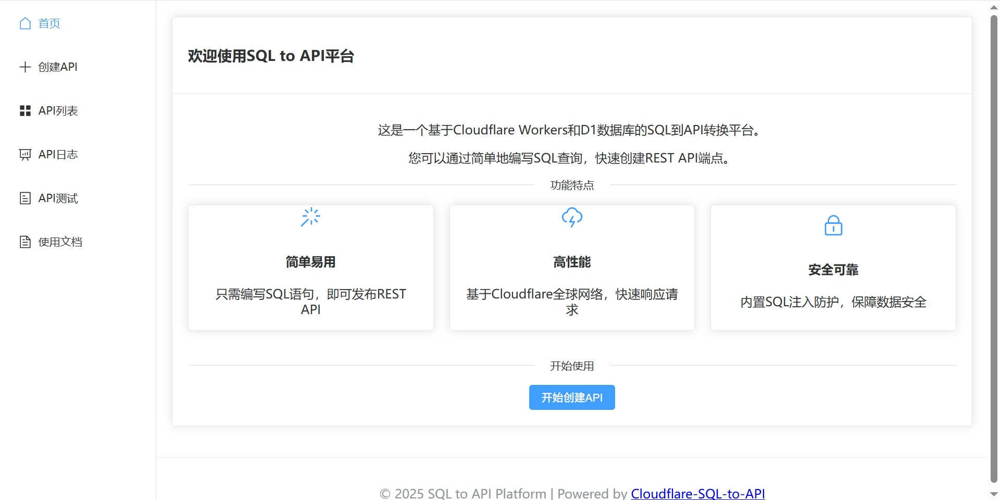
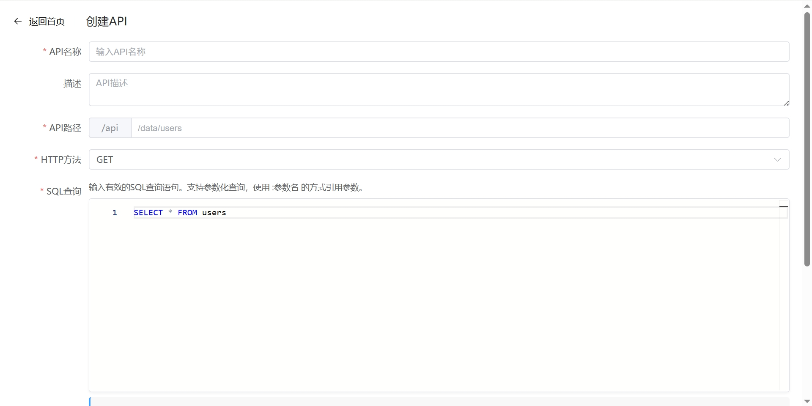
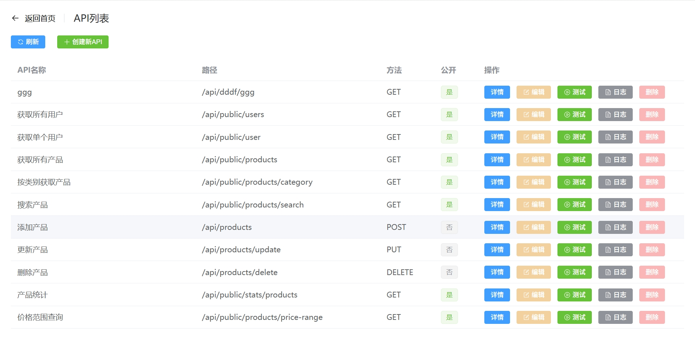
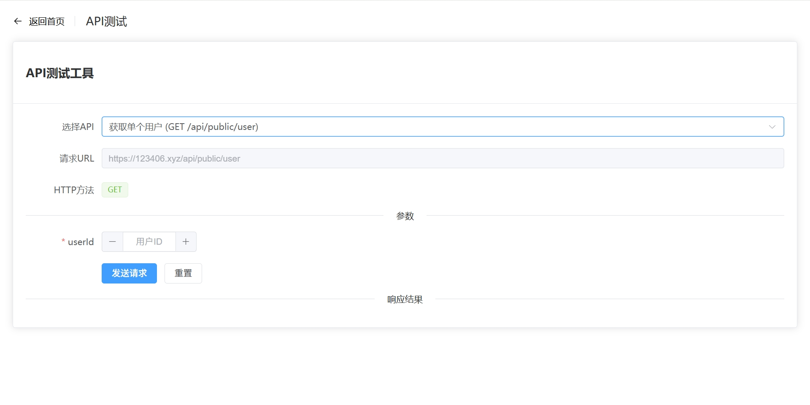
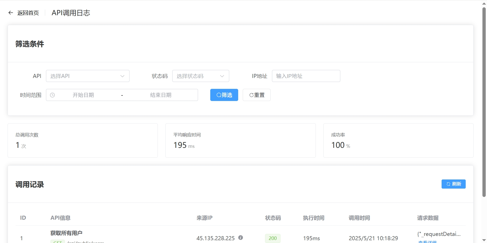
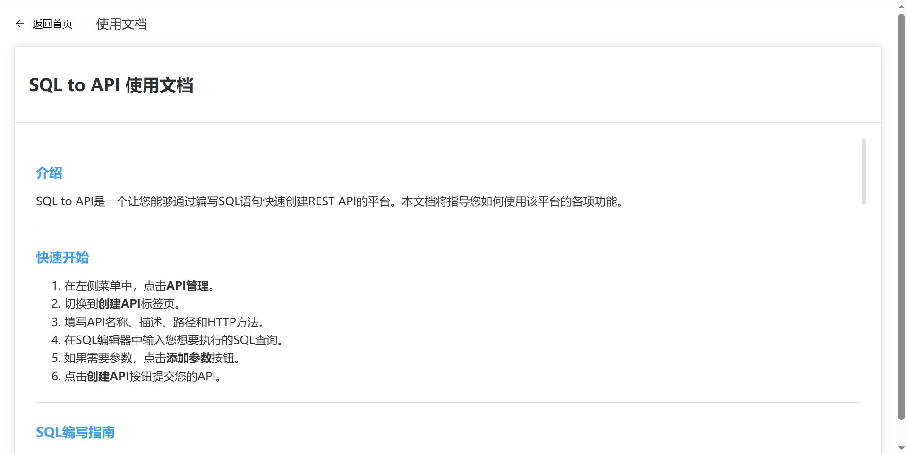

# SQL to API - Cloudflare Worker 应用

这是一个基于 Cloudflare Workers 和 D1 数据库的应用，可以通过编写 SQL 查询快速创建 REST API 接口。

## 在线预览

您可以通过以下链接访问在线演示版本：
[在线演示版本](https://123406.xyz)

## 特点

- **简单易用**: 只需编写 SQL 语句，即可发布 REST API
- **高性能**: 基于 Cloudflare 全球网络，快速响应请求
- **安全可靠**: 内置 SQL 注入防护，保障数据安全
- **零后端代码**: 无需编写后端代码，直接从数据库到 API

## 系统截图

### 首页



### 创建 API 页面



### API 列表页面



### API 测试工具页面



### API 调用日志页面



### 使用文档页面



## 开始使用

### 前提条件

- [Node.js](https://nodejs.org/) (v18 或更高版本)
- [pnpm](https://pnpm.io/) 包管理器
- [Cloudflare 账号](https://dash.cloudflare.com/sign-up)
- [Wrangler CLI](https://developers.cloudflare.com/workers/wrangler/install-and-update/)

### 安装

```bash
# 克隆项目
git clone <repository-url>
cd db-admin-app

# 安装依赖
pnpm install
```

### 本地开发

```bash
# 开发模式
pnpm dev

# 预览模式（使用Wrangler）
pnpm preview
```

### 创建 D1 数据库

```bash
# 登录Cloudflare
wrangler login

# 创建D1数据库
wrangler d1 create sql_api_db

# 更新wrangler.jsonc中的database_id为刚创建的数据库ID

# 应用数据库迁移
wrangler d1 execute sql_api_db --remote --file=./migrations/0000_initial_schema.sql

wrangler d1 execute sql_api_db --remote --file=./migrations/0001_table_schema.sql
```

### 部署到 Cloudflare

```bash
# 构建并部署
pnpm deploy
```

## 使用方法

1. 访问应用首页
2. 点击"API 管理"创建新的 API
3. 填写 API 基本信息并编写 SQL 查询
4. 提交表单，创建 API 端点
5. 使用"API 测试"功能验证 API

## API 参数

在创建 API 时，可以定义参数以动态替换 SQL 中的值。参数使用`:参数名`的形式在 SQL 中指定，例如：

```sql
SELECT * FROM users WHERE id = :userId
```

然后在参数定义部分添加`userId`参数，并指定类型和是否必填。

## 安全注意事项

- 默认禁用了 DROP 和 ALTER SQL 操作以保护数据库
- 建议在生产环境中添加适当的认证机制
- 公开 API 无需认证，请谨慎使用

## 项目结构

```
db-admin-app/
├── components/          # 前端组件
├── migrations/          # 数据库迁移脚本
├── pages/               # 页面组件
│   ├── index.vue        # 首页
│   ├── api-manager.vue  # API管理页面
│   └── api-tester.vue   # API测试页面
├── plugins/             # Nuxt插件
├── public/              # 静态资源
├── server/              # 服务器端代码
│   └── api/             # API路由处理
├── .nuxt/               # Nuxt构建文件
├── app.vue              # 应用入口
├── nuxt.config.ts       # Nuxt配置
├── package.json         # 项目依赖
└── wrangler.jsonc       # Cloudflare配置
```

## 技术栈

- **前端**: Vue 3, Nuxt 3, Element Plus, Monaco Editor
- **后端**: Cloudflare Workers, D1 数据库
- **构建工具**: Vite, Wrangler
